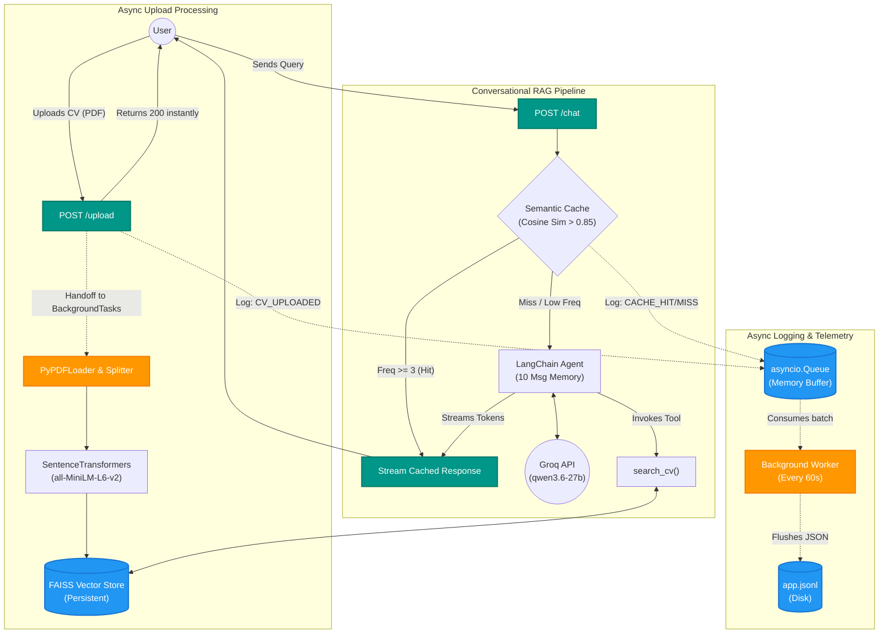

# Cplus-soft RAG Architecture

This diagram maps out the complete flow of your RAG application, detailing both synchronous user interactions and background asynchronous tasks. 

### Breakdown of the Components:

> [!TIP]
> **Endpoints**
> - **`POST /upload`**: Receives PDF. Pushes heavy processing to a background thread to return immediately.
> - **`POST /chat`**: The main interface. Expects a `session_id` and `query` string. Returns a streamed text response.

> [!NOTE]
> **Semantic Cache**
> Evaluates all queries as they enter `/chat` using `numpy`. If a user asks a similar question 3 times, the LLM is completely bypassed, zeroing out API costs and cutting latency to roughly zero.

> [!IMPORTANT]
> **Tool Calling Agent**
> Your agent decides autonomously if it needs to use the `search_cv` tool to lookup the FAISS database, or if it can answer entirely from its internal memory/parameters.

> [!TIP]
> **Telemetry (Logging)**
> Events don't block user requests. They are instantly pushed into a non-blocking queue. Every 60 seconds, a background daemon safely writes them to `app.jsonl`.
